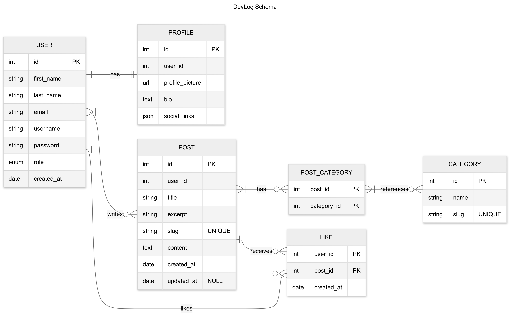

# DevLog

#### By John Daniel C. Garan

## Scope

This project is designed to support DevLog, a soon-to-be blogging platform aimed at developers and tech enthusiasts to share their knowledge, experiences, and insights within a community. The goal of DevLog is to create an environment where people in the tech field can publish articles, document their learning journeys, or exchange ideas. To bring this vision to life, I designed a relational database that serves as the foundation of DevLog. The database includes the following key entities:

-   **Users** – individuals who register to share their technical blogs, tutorials, experiences, etc.
-   **Profiles** – user information including bios, and links to their GitHub, X, and other professional profiles
-   **Categories** – topics covering areas such as Artificial Intelligence, Web Development, and programming languages like Python or JavaScript.
-   **Blog posts** – contents covering programming languages, frameworks, tools, best practices, and tech experiences
-   **Likes** – likes that allow readers to show appreciation for helpful or insightful posts

To maintain focus on the core blogging functionality, the following features are currently outside the scope of the project:

-   **Comments and discussions** – conversations between readers and users
-   **User followers or connections** – social networking features

Future iterations of DevLog may expand to include these features as the platform evolves.

## Functional Requirements

The database will support core user interactions and functionality, allowing users to:

#### Account and Profile Management

-   **Register and authenticate** – create accounts with unique usernames and emails, with role-based access by default for users
-   **Manage profiles** – create and update profile information, including bio, profile picture, and social media links (GitHub, X, LinkedIn)

#### Content Creation and Organization

-   **Create and publish blog posts** – write blog posts with titles, excerpts, slugs, and full content
-   **Edit and delete posts** – update their own published content or remove posts entirely
-   **Categorize content** – assign one or multiple categories to posts for better organization

#### Engagement and Discovery

-   **Browse by category** – explore posts grouped by topics such as Python, JavaScript, or DevOps
-   **Search for content** – find specific posts, users, or categories
-   **Engage with content** – like posts from other developers to show appreciation

#### Insights and Profiles

-   **View engagement statistics** – see like counts and engagement metrics on posts
-   **View user profiles** – see other developers' bios, social links, and their published posts
-   **Track contributions** – view summaries of their own posts and received likes

#### ⚠️ Out of Scope

Note that in this iteration, users will not be able to:

-   **Comment on posts** – users cannot yet discuss or provide feedback directly on blog posts
-   **Follow other users** – users cannot follow other users or receive updates
-   **Upload media files** – embedding images or videos directly is not yet supported

## Representation

The database includes the following entities:

### Entities

#### Users

The `users` table represents individuals registered on DevLog. Each user has identifying and authentication information, along with a role to define their access level.

-   `id` – specifies a unique, auto-incrementing identifier for each user. This column has the `PRIMARY KEY` constraint and is stored as `SERIAL`.
-   `first_name` and `last_name` – specify the user's first and last names, stored as `VARCHAR(100)` to accommodate typical name lengths.
-   `email` – stores the user’s email address as `VARCHAR(100)` to accommodate both the username and domain parts of an address. It includes a `UNIQUE` constraint to ensure each account has a distinct email.
-   `username` – stored as `VARCHAR(150)` to allow sufficient length for display or login names. The `UNIQUE` constraint prevents duplicate usernames.
-   `password` – `VARCHAR`, allowing enough flexibility for hashed passwords of varying lengths.
-   `role` – defines the user’s access level or role within the platform, stored as a custom `ENUM` type `user_role`. It defaults to `'user'` when not explicitly set, ensuring every account is assigned a valid role.
-   `created_at` – records the timestamp of when the user account was created, stored as `TIMESTAMPTZ` to include both date/time and timezone information. It uses `DEFAULT` `CURRENT_TIMESTAMP` to automatically log the creation moment.

All columns, except where specified otherwise, use the `NOT NULL` constraint to ensure that essential user information is always provided.

#### Profiles

The `profiles` table represents the users table by storing additional personal information associated with each user on DevLog. It extends the `users` table by including optional details that customize a user’s public profile.

-   `id` – specifies a unique, auto-incrementing identifier for each profile. This column has the `PRIMARY KEY` constraint and is stored as `SERIAL`.
-   `user_id` – references the `id` column in the `users` table. It is stored as `INT` with a `NOT NULL` constraint to ensure every profile is linked to a valid user.
-   `profile_picture` – stored as `TEXT`, stores URLs or paths to profile images.
-   `bio` – stored as `TEXT`, allowing users to include a personal description or short introduction without length constraints.
-   `social_links` – stored as `JSONB`, enabling structured storage of social media URLs or external links. It defaults to an empty object `'{}'::jsonb` to avoid null values and simplify data handling.

The `FOREIGN KEY` constraint on `user_id` enforces referential integrity, ensuring each profile is tied to an existing user. The `ON DELETE CASCADE` rule automatically removes a profile when its associated user is deleted.

#### Blog Posts

The `posts` table represents all blog entries created by users on DevLog. Each post includes core publishing details such as title, content, user reference, and timestamps for creation and updates.

-   `id` – specifies a unique, auto-incrementing identifier for each post. This column has the `PRIMARY KEY` constraint and is stored as `SERIAL`.
-   `user_id` – stored as `INT`, and references the `id` column in the `users` table, identifying the user of the post.
-   `title` – stored as `VARCHAR(255)` but restricted by a `CHECK` constraint `(length(title) <= 100)` to maintain concise, readable titles.
-   `excerpt` – stored as `TEXT`, providing an optional short summary or preview of the post’s content.
-   `slug` – stored as `VARCHAR`, URL-friendly version of the title for routing and readability.
-   `content` – stored as `TEXT`, main body of the post.
-   `created_at` – records the timestamp when the post was first created, stored as `TIMESTAMPTZ` to include timezone information. It uses `DEFAULT CURRENT_TIMESTAMP` to automatically log the post creation moment.
-   `updated_at` – stored as `TIMESTAMPTZ`, recording the timestamp of the most recent post update. This field is optional, allowing null values if a post hasn’t been modified since creation.

All critical columns use `NOT NULL` constraints to preserve data integrity and ensure that essential post information is always present.

#### Categories

The `categories` table defines the different technology or topic areas to which blog posts can belong, supporting filtering and organization.

-   `id` – specifies a unique, auto-incrementing identifier for each category. This column has the `PRIMARY KEY` constraint and is stored as `SERIAL`.
-   `title` – stored as `VARCHAR(150)`, representing the display name of the category.
-   `slug` – slug – stored as `VARCHAR(255)`, providing a URL-friendly version of the category title for routing or referencing.

The combination of `NOT NULL` and `UNIQUE` constraints across title and slug ensures clear, unique category identification within the platform.

The `post_categories` table connects the `posts` and `categories` tables, establishing a many-to-many relationship. It allows posts to belong to multiple categories and categories to contain multiple posts.

-   `post_id` – references the `id` column in the `posts` table, identifying the post being categorized. It is stored as `INT` with a `NOT NULL` constraint to ensure that each record links to a valid post.
-   `category_id` – references the `id` column in the categories table, identifying the category assigned to the post. It is stored as `INT` with a `NOT NULL` constraint to ensure that each record links to a valid category.

The composite `PRIMARY KEY (post_id, category_id)` prevents duplicate associations between the same post and category, ensuring that each link is unique.

The `FOREIGN KEY` constraints maintain referential integrity between the `post_categories`, `posts`, and `categories` tables. The `ON DELETE CASCADE` rules automatically remove related associations when a post or category is deleted, keeping the database consistent and free of orphaned records.

#### Likes

The `likes` table records user interactions with posts on DevLog. It serves as a junction table linking users and posts, tracking which user has liked which post and when the like occurred.

-   `user_id` – references the `id` column in the `users` table, identifying the user who performed the like. It is stored as `INT` with a `NOT NULL` constraint to ensure that every like is associated with a valid user.
-   `post_id` – references the `id` column in the `posts` table, identifying the post that received the like. It is stored as `INT` with a `NOT NULL` constraint to ensure that every like corresponds to a valid post.
-   `created_at` – records the timestamp when the like was made, stored as `TIMESTAMPTZ` to include timezone information. It uses DEFAULT `CURRENT_TIMESTAMP` and `NOT NULL` to automatically record the exact moment of interaction.

The composite `PRIMARY KEY (user_id, post_id)` ensures that a user can like a specific post only once, preventing duplicate entries.

The `FOREIGN KEY` constraints maintain referential integrity between the likes, users, and posts tables. The `ON DELETE CASCADE` rules ensure that when a user or post is removed, all associated likes are automatically deleted to preserve database consistency.

### Relationships

The diagram below shows how the main parts of DevLog connect to each other. Each relationship describes how users, posts, profiles, categories, and likes interact within the platform.

As detailed by the diagram:

-   Every user has exactly one profile that holds their personal details, like their bio, profile picture, and social links. When a user is removed, their profile disappears with them.
-   A user can write many posts, but each post belongs to only one user. This makes it easy to see who created what on the platform.
-   Posts can be referenced under multiple categories, and each category can include several posts. This setup helps organize content by topic and makes it easier for readers to find related posts.
-   Users can like as many posts as they want, and each post can receive likes from multiple users. It’s a simple way to track engagement and show appreciation for content.
-   If a user or post is deleted, their related data, such as profiles, likes, and categorized links, is also removed. This keeps the system clean and prevents leftover records that no longer connect to anything.

## Optimizations

#### Indexes

To make the database run faster and more efficient, several indexes were added on how data is most often accessed.

-   It's common for users to view or manage all the blog posts written by a specific user. For that reason, indexes for `posts` per `user_id` is created. This index helps those lookups happen quickly.
-   Users also often want to see which posts they’ve liked. To make this smoother, an index for `likes` per `user_id` is added. It speeds up finding all the likes belonging to a particular user.
-   When loading a post, the system might need to display how many people liked it. To handle this efficiently, an index for `likes` per `post_id` is created. This makes retrieving all likes on a post faster.
-   Each post can belong to multiple categories, and the app frequently needs to list them. Because of that, an index for `post_categories` per `post_id` is added to improve how quickly those categories load.
-   Likewise, users might browse posts by category. To make that process faster, an index for `post_categories` per `category_id` is created. This helps quickly gather all posts under a specific category.

#### Functions

PostgreSQL supports creating custom functions, so I take advantage of this feature to create usable functions for common queries.

-   It’s useful to know how much engagement a post is getting. The `get_post_likes` function handles that by counting all the likes tied to a specific post. Instead of writing the same query over and over, this function neatly wraps it up so the total likes can be fetched in one call.
-   Sometimes, it’s helpful to show all posts that fall under a certain category, especially when browsing by topic. The `get_posts_by_category` function makes that easy. It pulls together the user’s username, the category name, and the post details in one go, giving a clear view of everything connected to that category.

#### Views

PostgreSQL also supports creating views, which act like saved queries that present data in a readable and organized way. I created a few to simplify how key information can be accessed or summarized.

-   `user_overview` summarizes each user’s activity by showing their username, email, total number of posts, and total likes received across all their posts. It gives a quick snapshot of how active or popular a user is.
-   `post_overview` lists every post along with its user, short description, creation date, and the total number of likes. It’s useful for displaying blog content with relevant engagement stats without needing complex joins every time.
-   `category_summary` shows how many posts belong to each category. It provides a clear picture of which topics are most active or popular in the blog.

## Limitations

-   **No support for commets or discussions** – The current schema only allows users to like posts, but they can’t comment, reply, or engage in threaded discussions. This limits meaningful interaction between users and other users, making posts more like static articles than community-driven conversations.
-   **No user following or subscription system.** – Users can’t follow other users or receive updates from their favorite users.
-   **Posts are limited to fixed categories only.** – Each post must belong to existing categories in the database, but there’s no tagging feature that allows for more flexible topic labeling. This means that if a post doesn’t fit neatly into a category that the admin of the dabase added, it either goes uncategorized or forces the creation of a new category, both of which can clutter the platform over time.
-   **Upload media files** – The current schema doesn’t include any mechanism for storing or managing media uploads such as images, videos, or attachments. Users can’t embed visuals directly into posts or profiles beyond linking to external URLs. This limits creative presentation, as every piece of media must live elsewhere instead of being managed securely within the platform.
